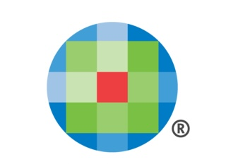
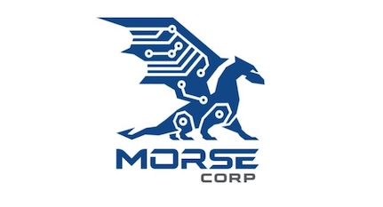

<!-- Toggle Button -->
<button id="toc-toggle" class="toc-toggle-btn">📑 Show TOC</button>

<!-- TOC Container -->

    

        <h3>📑 Table of Contents</h3>
        <ul>
            <li><a href="#about">About Me</a></li>
            <li><a href="#work-experience">Work Experience</a></li>
            <li><a href="#education">Education</a></li>
            <li><a href="#technical-skills">Technical Skills</a></li>
            <li><a href="#projects">Projects</a></li>
            <li><a href="#contact">Contact</a></li>
        </ul>
    

# Jason Zhang | Data Science, Engineering, and Software Development Portfolio

## 👨‍💻 About Me

  <!-- Replace with your profile image -->

Hi, I'm Jason Zhang, an ambitious professional with a focus on Data Science, Engineering, and Software Development. I am passionate about building scalable data pipelines, optimizing machine learning models, and developing software systems. With experience at U.S. DOT, Wolters Kluwer, and MORSE Corp, I am eager to contribute to impactful data-driven solutions and continue growing in my career.

---

## 💼 Featured Work Experience

### **Data Scientist**  
**U.S. DOT Volpe Center** | Cambridge, MA | **July 2024 – Present**  
  <!-- Replace with U.S. DOT logo -->
- Engineered **ETL pipelines** using Apache Airflow and AWS Glue for processing **20,000+ records annually**, reducing data processing time by **60%**.  
- Prototyped **LLM Retrieval-Augmented Generation (RAG) models** with Hugging Face Transformers, enhancing documentation retrieval efficiency by **30%**, saving **200+ hours annually**.  
- Authored comprehensive memos on **NIST AI RMF**, promoting **AI risk management adoption** across teams.

---

### **Software Engineer Co-op**  
**Wolters Kluwer** | Waltham, MA | **July 2023 – January 2024**  
  <!-- Replace with Wolters Kluwer logo -->
- Developed a **Spring Boot microservice** leveraging Google Cloud Translation API to process **100,000+ medical documents daily**.  
- Re-implemented backend image retrieval using **Elasticsearch, S3, and JAX-RS**, reducing load times by **20%**.  
- Enhanced **user data schema** for improved password security and deployed updates to production.  
- Streamlined infrastructure by retiring a legacy microservice with **Docker** and **Jenkins**, decreasing global server load.

---

### **Data Engineering Researcher**  
**Northeastern University Khoury College** | Boston, MA | **December 2022 – May 2023**  
- Re-architected databases with **Redis distributed clusters**, improving computation framework speed by **20%**.  
- Leveraged **Redis Cloud** for 99.99% uptime, ensuring scalability and durability.  
- Refactored codebase with **OOP principles** and implemented automated testing for maintainability.

---

### **Data Science Co-op**  
**MORSE Corp** | Cambridge, MA | **July 2022 – January 2023**  

- Implemented a **time series bootstrap method** in NumPy to estimate statistical uncertainty in temporal data.  
- Optimized dataset splits, reducing preprocessing time by **30%**, and created a reusable **EDA and synthetic data library** used by 8 engineers.  
- Maintained **ETL pipelines** with PySpark, reducing data lag by **15%** and automating documentation via Dockerized CI/CD pipelines.

---

## 📚 Education

### **M.S. in Bioinformatics**  
**Northeastern University, College of Science** | **September 2024 – May 2026** | **GPA: 4.0/4.0**  
- **Coursework**: Bioinformatics Programming, Computational Methods in Bioinformatics, Algorithms, Statistics for Bioinformatics  

### **B.S. in Data Science and Mathematics**  
**Northeastern University, Khoury College of Computer Sciences** | **September 2020 – May 2024** | **GPA: 4.0/4.0**  
- **Coursework**: Machine Learning, Large-Scale Data Storage, Data Science Foundations, Object-Oriented Design, Stochastic Probability, Linear Algebra  

---

## 👩‍💻 Technical Skills

- **Languages**: Python, PyTorch, TensorFlow, Scikit-learn, Pandas, Flask, SQL, Java, R, Bash, TypeScript  
- **Data Engineering**: Apache Airflow, Docker, Spark, AWS, GCP, MongoDB, Redis, Neo4j  
- **Tools & Frameworks**: Tableau, ELK Stack, Jenkins, JAX-RS, Spring Boot  

---

## 🚀 Projects

### **1. AirflowIQ: Scalable Workflow Automation**  
  <!-- Replace with your project screenshot -->
- **Description**: Developed a scalable ETL pipeline using Apache Airflow and AWS for real-time analytics.  
- **Skills**: Python, Airflow, SQL, Docker  
- **GitHub**: [View Project](https://github.com/jjz17/AirflowIQ)  

---

### **2. Photo Quality Prediction**  
  <!-- Replace with your project screenshot -->
- **Description**: Built a CNN-based ML model for predicting image quality using PyTorch and OpenCV.  
- **Skills**: Deep Learning, PyTorch, OpenCV  
- **GitHub**: [View Project](https://github.com/jjz17/photo-quality-prediction)  

---

### **3. Twitter Sentiment Dashboard**  
  <!-- Replace with your project screenshot -->
- **Description**: Designed a Flask dashboard for real-time Twitter sentiment analysis using NLP techniques.  
- **Skills**: Python, Flask, Plotly, NLP  
- **GitHub**: [View Project](https://github.com/jjz17/twitter-dashboard)  

---

## 📬 Contact

- **Email**: [jasonjzhang17@gmail.com](mailto:jasonjzhang17@gmail.com)  
- **GitHub**: [github.com/jjz17](https://github.com/jjz17)  
- **LinkedIn**: [linkedin.com/in/your-profile](https://linkedin.com/in/your-profile)  

---

### 🔗 Live Website

Visit my portfolio at: [https://jjz17.github.io](https://jjz17.github.io)
