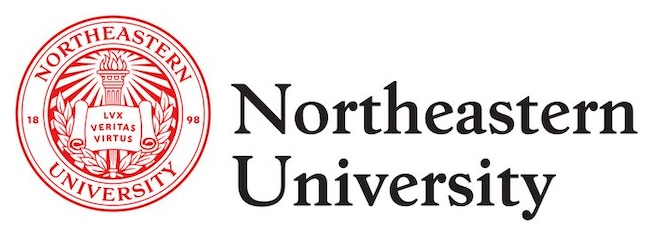

<!-- Toggle Button -->
<button id="toc-toggle" class="toc-toggle-btn">☰</button>

<!-- TOC Container -->

    <ul>
        <li><a href="#about">About Me</a></li>
        <li><a href="#work-experience">Work Experience</a></li>
        <li><a href="#education">Education</a></li>
        <li><a href="#technical-skills">Technical Skills</a></li>
        <li><a href="#projects">Projects</a></li>
        <!-- <li><a href="#blog">Blog</a></li> -->
    </ul>

## 👨‍💻 About Me

<!--  -->

Hi, I'm Jason Zhang, an ambitious professional with a focus on Data Science, Engineering, and Software Development. I am passionate solving complex problems with scalable data pipelines, optimized machine learning models, and robust software systems. With experience at U.S. DOT, Wolters Kluwer, and MORSE Corp, I am eager to contribute to impactful data-driven solutions and continue growing in my career.

---

## 💼 Featured Work Experience

 

    

      
      <h3>Data Scientist</h3>
      
U.S. DOT Volpe Center

      
Washington, D.C.

      
June 2023 - Present

    

    

    <ul>
        <li>- Engineered <strong>ETL pipelines</strong> using Apache Airflow and AWS Glue for processing <strong>20,000+ records annually</strong>, reducing data processing time by <strong>60%</strong>.</li>
        <li>- Prototyped <strong>LLM Retrieval-Augmented Generation (RAG) models</strong> with Hugging Face Transformers, enhancing documentation retrieval efficiency by <strong>30%</strong>, saving <strong>200+ hours annually</strong>.</li>
        <li>- Authored comprehensive memos on <strong>NIST AI RMF</strong>, promoting <strong>AI risk management adoption</strong> across teams.</li>
    </ul>
    

  

  
  

    

      
      <h3>SWE Co-op</h3>
      
Wolters Kluwer

      
Boston, MA

      
Jan 2022 - May 2023

    

    

        <ul>
            <li>- Developed a <strong>Spring Boot microservice</strong> leveraging Google Cloud Translation API to process <strong>100,000+ medical documents daily</strong>.</li>
            <li>- Re-implemented backend image retrieval using <strong>Elasticsearch, S3, and JAX-RS</strong>, reducing load times by <strong>20%</strong>.</li>
            <li>- Enhanced <strong>user data schema</strong> for improved password security and deployed updates to production.</li>
            <li>- Streamlined infrastructure by retiring a legacy microservice with <strong>Docker</strong> and <strong>Jenkins</strong>, decreasing global server load.</li>
        </ul>
    

  

   

    

      
      <h3>Data Engineer</h3>
      
NEU Khoury College

      
Boston, MA

      
June 2023 - Present

    

    

    <ul>
        <li>- Re-architected databases with <strong>Redis distributed clusters</strong>, improving computation framework speed by <strong>20%</strong>.</li>
        <li>- Leveraged <strong>Redis Cloud</strong> for 99.99% uptime, ensuring scalability and durability.</li>
        <li>- Refactored codebase with <strong>OOP principles</strong> and implemented automated testing for maintainability.</li>
    </ul>
    

  

  
  

    

      
      <h3>Data Science Co-op</h3>
      
MORSE Corp

      
Cambridge, MA

      
Jan 2022 - May 2023

    

    

    <ul>
        <li>- Implemented a <strong>time series bootstrap method</strong> in NumPy to estimate statistical uncertainty in temporal data.</li>
        <li>- Optimized dataset splits, reducing preprocessing time by <strong>30%</strong>, and created a reusable <strong>EDA and synthetic data library</strong> used by 8 engineers.</li>
        <li>- Maintained <strong>ETL pipelines</strong> with PySpark, reducing data lag by <strong>15%</strong> and automating documentation via Dockerized CI/CD pipelines.</li>
    </ul>
    

  

&nbsp;

---

## 📚 Education

 

    

      
      <h3>M.S. Bioinformatics</h3>
      
NEU College of Science

      
Boston, MA

      
Sep 2024 - May 2026

    

    

    <ul>
        <li><strong>GPA:</strong> 4.0</li>
        <li><strong>Coursework:</strong></li>
        <!-- <li><strong>Coursework:</strong> Bioinformatics Programming, Computational Methods in Bioinformatics, Algorithms, Statistics for Bioinformatics.</li> -->
        <li>- Bioinformatics Programming</li>
        <li>- Computational Methods in Bioinformatics</li>
        <li>- Algorithms</li>
        <li>- Statistics for Bioinformatics</li>
    </ul>
    

  

  
  

    

      
      <h3>B.S. Data Science and Math</h3>
      
NEU Khoury College

      
Boston, MA

      
Sep 2020 - May 2024

    

    

    <ul>
        <li><strong>GPA:</strong> 4.0</li>
        <li><strong>Coursework:</strong></li>
        <li>- Machine Learning</li>
        <li>- Large-Scale Data Storage</li>
        <li>- Data Science Foundations</li>
        <li>- Object-Oriented Design</li>
        <li>- Stochastic Probability</li>
        <li>- Linear Algebra</li>
    </ul>
    

  

&nbsp;

---

## 👩‍💻 Technical Skills

- **Languages**: Python, PyTorch, TensorFlow, Scikit-learn, Pandas, Flask, SQL, Java, R, Bash, TypeScript  
- **Data Engineering**: Apache Airflow, Docker, Spark, AWS, GCP, MongoDB, Redis, Neo4j  
- **Tools & Frameworks**: Tableau, ELK Stack, Jenkins, JAX-RS, Spring Boot  

---

## 🚀 Projects

 

    

      
      <h3><a href="https://github.com/jjz17/AirflowIQ">AirflowIQ</a></h3>
      
Scalable Workflow Automation

      
Skills: Python, Airflow, SQL, Docker

    

    

    <ul>
        <li>- Engineered <strong>ETL pipelines</strong> using Apache Airflow and AWS Glue for processing <strong>20,000+ records annually</strong>, reducing data processing time by <strong>60%</strong>.</li>
        <li>- Prototyped <strong>LLM Retrieval-Augmented Generation (RAG) models</strong> with Hugging Face Transformers, enhancing documentation retrieval efficiency by <strong>30%</strong>, saving <strong>200+ hours annually</strong>.</li>
        <li>- Authored comprehensive memos on <strong>NIST AI RMF</strong>, promoting <strong>AI risk management adoption</strong> across teams.</li>
    </ul>
    

  

  
  

    

      
      <h3><a href="https://github.com/jjz17/photo-quality-prediction">Photo Quality Prediction</a></h3>
      
CNN-based ML model

      
Skills: Deep Learning, PyTorch, OpenCV

    

    

        <ul>
            <li>- Developed a <strong>Spring Boot microservice</strong> leveraging Google Cloud Translation API to process <strong>100,000+ medical documents daily</strong>.</li>
            <li>- Re-implemented backend image retrieval using <strong>Elasticsearch, S3, and JAX-RS</strong>, reducing load times by <strong>20%</strong>.</li>
            <li>- Enhanced <strong>user data schema</strong> for improved password security and deployed updates to production.</li>
            <li>- Streamlined infrastructure by retiring a legacy microservice with <strong>Docker</strong> and <strong>Jenkins</strong>, decreasing global server load.</li>
        </ul>
    

  

   

    

      
      <h3><a href="https://github.com/jjz17/twitter-dashboard">Twitter Sentiment Dashboard</a></h3>
      
Flask dashboard for real-time analytics

      
Skills: Python, Flask, Plotly, NLP

    

    

    <ul>
        <li>- Re-architected databases with <strong>Redis distributed clusters</strong>, improving computation framework speed by <strong>20%</strong>.</li>
        <li>- Leveraged <strong>Redis Cloud</strong> for 99.99% uptime, ensuring scalability and durability.</li>
        <li>- Refactored codebase with <strong>OOP principles</strong> and implemented automated testing for maintainability.</li>
    </ul>
    

  

  
  

    

      
      <h3>Tennis Match Prediction</h3>
      
XGBoost model to predict outcomes of tennis matches

      
Skills: Python, Flask, Plotly, NLP

    

    

    <ul>
        <li>- Implemented a <strong>time series bootstrap method</strong> in NumPy to estimate statistical uncertainty in temporal data.</li>
        <li>- Optimized dataset splits, reducing preprocessing time by <strong>30%</strong>, and created a reusable <strong>EDA and synthetic data library</strong> used by 8 engineers.</li>
        <li>- Maintained <strong>ETL pipelines</strong> with PySpark, reducing data lag by <strong>15%</strong> and automating documentation via Dockerized CI/CD pipelines.</li>
    </ul>
    

  

